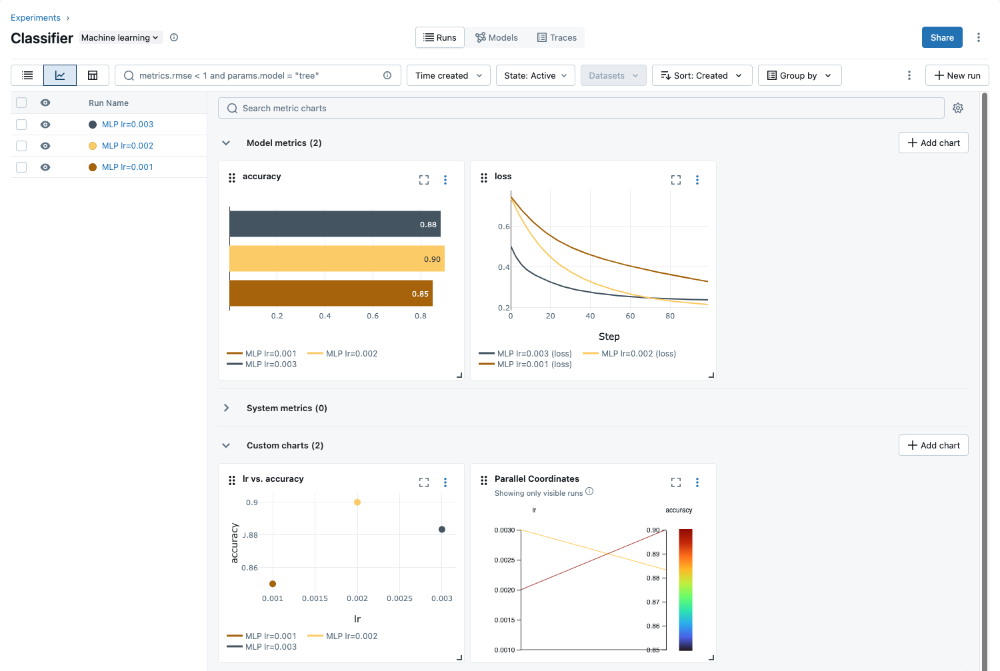

# MLFLow Example
Log and compare parameters, metrics, models, and artifacts from different runs.

## Install UV
UV is a dependency manager, it is used to install 3rd party tools like mlflow, like pip or conda.

https://docs.astral.sh/uv/getting-started/installation/

## Train the MLP
The first run takes a minute to install everything
```bash
uv run main.py 
```

## Train the model again with a differnt learning rate
MLFlow will save the training of the above and current run separtely but you can compare them later.
```bash
uv run main.py --lr 0.002
```

## Create a webserver for your MLFlow Dashboard
Choose your own port, on a shared server this can be an issue
```bash
.venv/bin/mlflow ui -p 8080 --backend-store-uri sqlite:///mlruns.db
```

## If you need to tunnel into the server
Execute this on you local machine
```bash
ssh -N -L 8080:localhost:8080 server.address.edu
```

## Open the Dashboard
In your web browser open 
```
localhost:8080
```

## MLFlow organizes and visualizes your experiments
We can compare the different runs, with the different learning rates.



## MLFlow manages your artifacts


